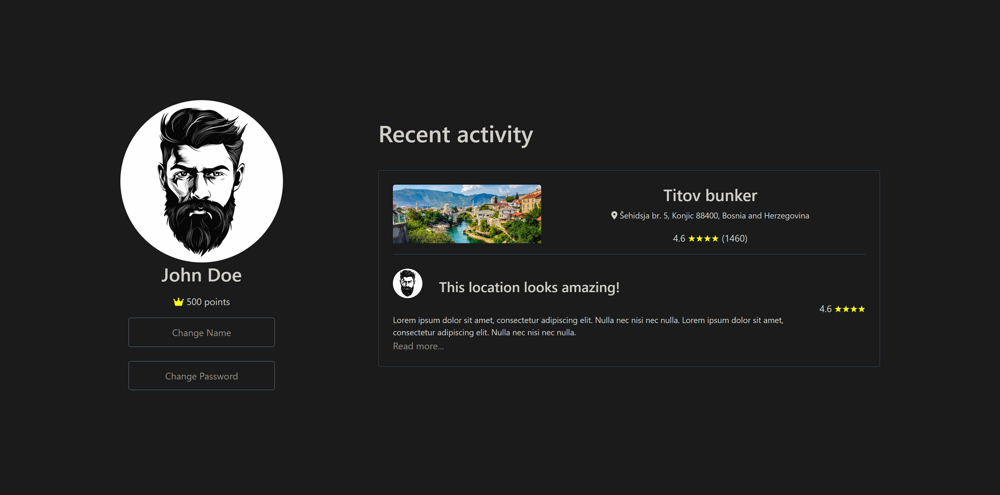

# Profile Page

This project is a React web application that serves as a profile page for users. It displays user information, recent activities, and provides options to change the user's name and password. Here's a breakdown of what has been done:

## Frontend Implementation

The frontend of the profile page is implemented using React. It consists of the following components:

- **ProfilePage**: The main component that fetches user data from the backend API and renders the profile information and recent activities.

- **ProfileInfo**: Renders the user's profile picture, name, points, and buttons to change the user's name and password.

- **RecentActivities**: Displays the user's recent activities including activity images, names, locations, comments, ratings, and the option to read more.

- **Modal**: Modals are used to prompt users for changing their name and password. These modals allow users to input new values and save changes.

## Backend Integration

For now, the backend API calls are not implemented. Instead, mock data is used to simulate fetching user information. The `fetchUserData` function in the `ProfilePage` component fetches mock user data and updates the state accordingly.

## Styling

Bootstrap and custom CSS styles are used for styling the components. Buttons are customized to have a transparent background, grey border, and grey text. Stars in the recent activities section are colored yellow to signify ratings.

## How It Works

1. When the application starts, it fetches user data from the backend API using the `fetchUserData` function. This data includes the user's profile information and recent activities.

2. The fetched user data is then passed down to the `ProfileInfo` and `RecentActivities` components to render the profile information and recent activities respectively.

3. Users can click on the "Change Name" and "Change Password" buttons in the `ProfileInfo` component to open modals where they can input new values and save changes.

4. After making changes in the modals and clicking "Save Changes", the page reloads to reflect the updated user information.

## Next Steps

To complete the integration with the backend API, actual API endpoints need to be implemented for fetching user data and updating user information (changing name and password). Once the backend API is ready, the frontend API calls should be updated to make requests to the actual endpoints. Additionally, error handling should be implemented to handle cases where the API requests fail.
